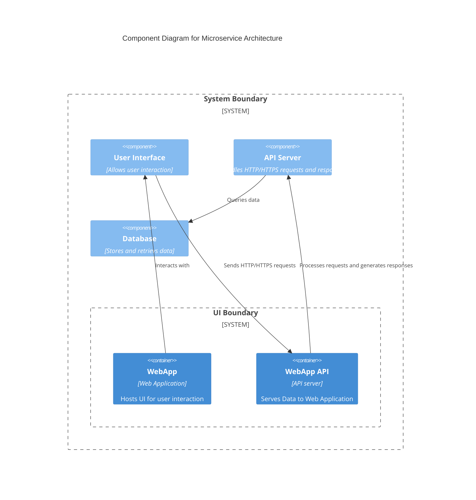
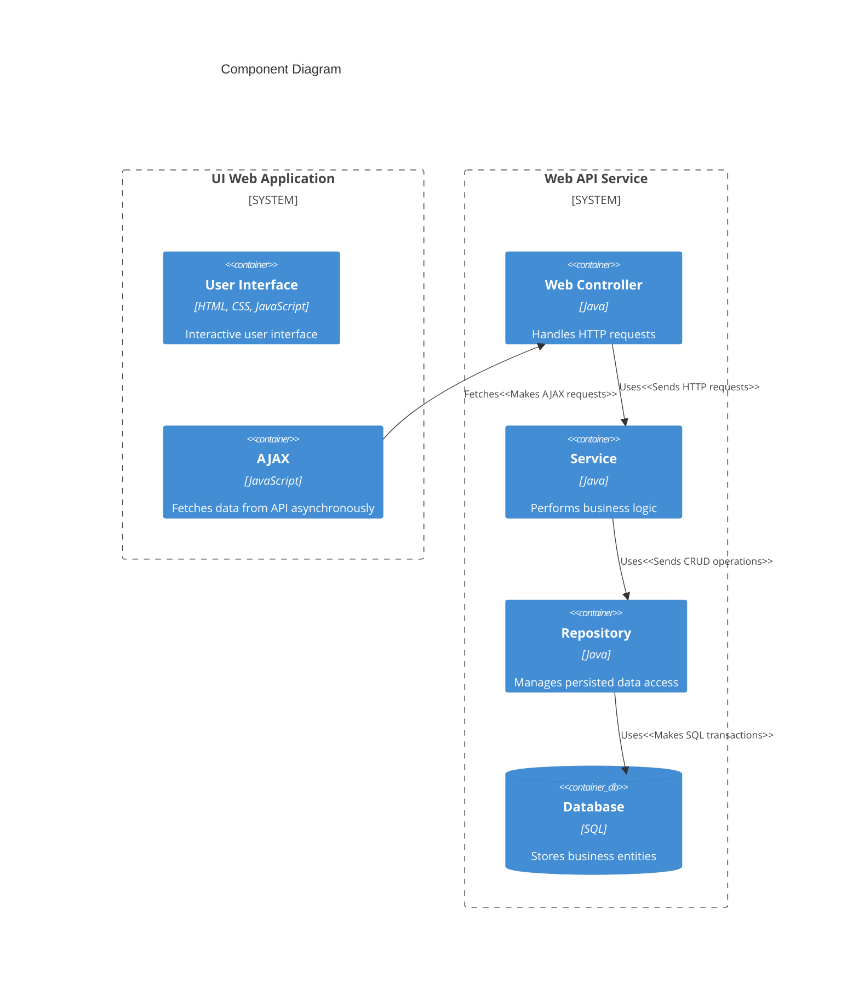
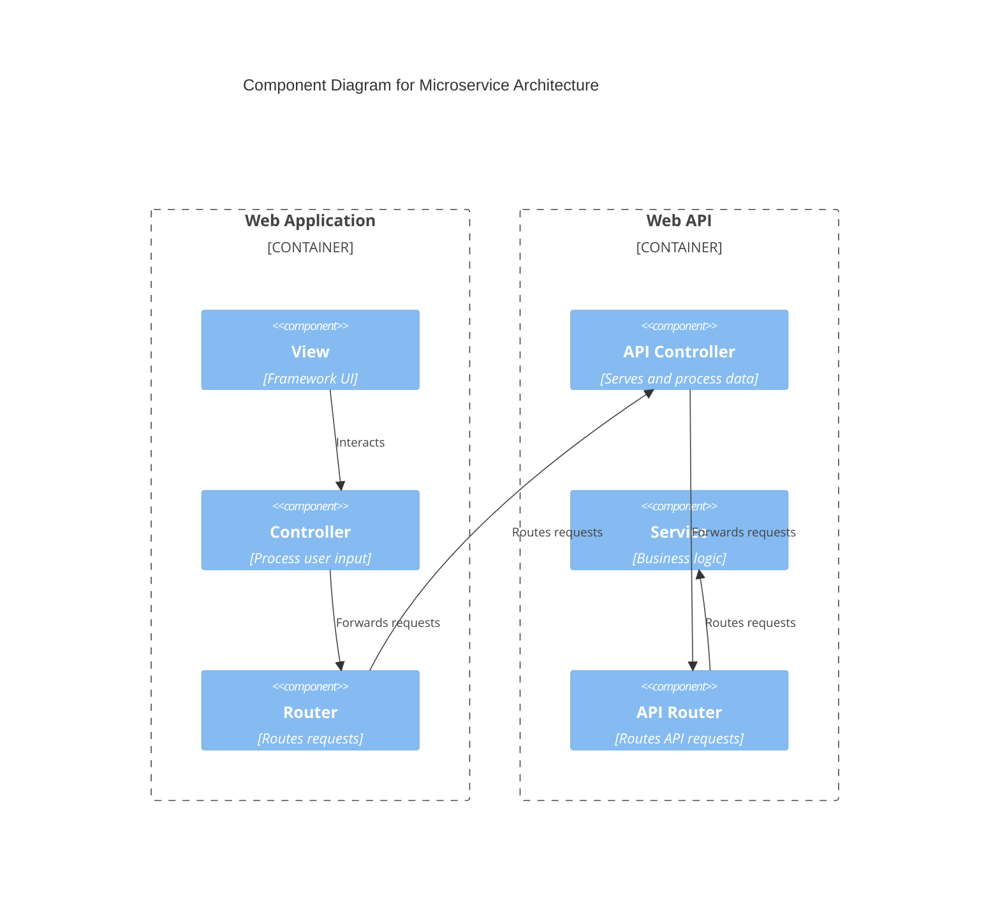

```mermaid
C4Component
  title Component Diagram for Microservice Architecture

  System_Boundary(systemBoundary, "System Boundary") {

    System_Boundary(uiBoundary, "UI Boundary") {
      Container(webApp, "WebApp", "Web Application", "Hosts UI for user interaction")
      Container(webAppAPI, "WebApp API", "API server", "Serves Data to Web Application")
    }
     
    Component(userInterface, "User Interface", "Allows user interaction")
    Component(apiserver, "API Server", "Handles HTTP/HTTPS requests and responses")
    Component(database, "Database", "Stores and retrievs data")

    Rel(webApp, userInterface, "Interacts with")
    Rel(userInterface, webAppAPI, "Sends HTTP/HTTPS requests")
    Rel(webAppAPI, apiserver, "Processes requests and generates responses")
    Rel(apiserver, database, "Queries data")

  }

```

```mermaid
C4Component
  title Component Diagram

  System_Boundary(uiBoundary, "UI Web Application") {
    Container(userInterface, "User Interface", "HTML, CSS, JavaScript", "Interactive user interface")
    Container(ajax, "AJAX", "JavaScript", "Fetches data from API asynchronously")
  }

  System_Boundary(apiBoundary, "Web API Service") {
    Container(webController, "Web Controller", "Java", "Handles HTTP requests")
    Container(service, "Service", "Java", "Performs business logic")
    Container(repository, "Repository", "Java", "Manages persisted data access")
    ContainerDb(database, "Database", "SQL", "Stores business entities")

    Rel(webController, service, "Uses<<Sends HTTP requests>>")
    Rel(service, repository, "Uses<<Sends CRUD operations>>")
    Rel(repository, database, "Uses<<Makes SQL transactions>>")
  }

  Rel(ajax, webController, "Fetches<<Makes AJAX requests>>")
```

```mermaid
C4Component
  title Component Diagram for Microservice Architecture
  
  Container_Boundary(webBoundary, "Web Application") {
    Component(view, "View", "Framework UI")
    Component(controller, "Controller", "Process user input")
    Component(router, "Router", "Routes requests")
  }
  
  Container_Boundary(apiBoundary, "Web API") {
    Component(apiController, "API Controller", "Serves and process data")
    Component(service, "Service", "Business logic")
    Component(apiRouter, "API Router", "Routes API requests")
  }
  
  Rel(view, controller, "Interacts")
  Rel(controller, router, "Forwards requests")
  
  Rel(router, apiController, "Routes requests")
  Rel(apiController, apiRouter, "Forwards requests")
  Rel(apiRouter, service, "Routes requests")
```