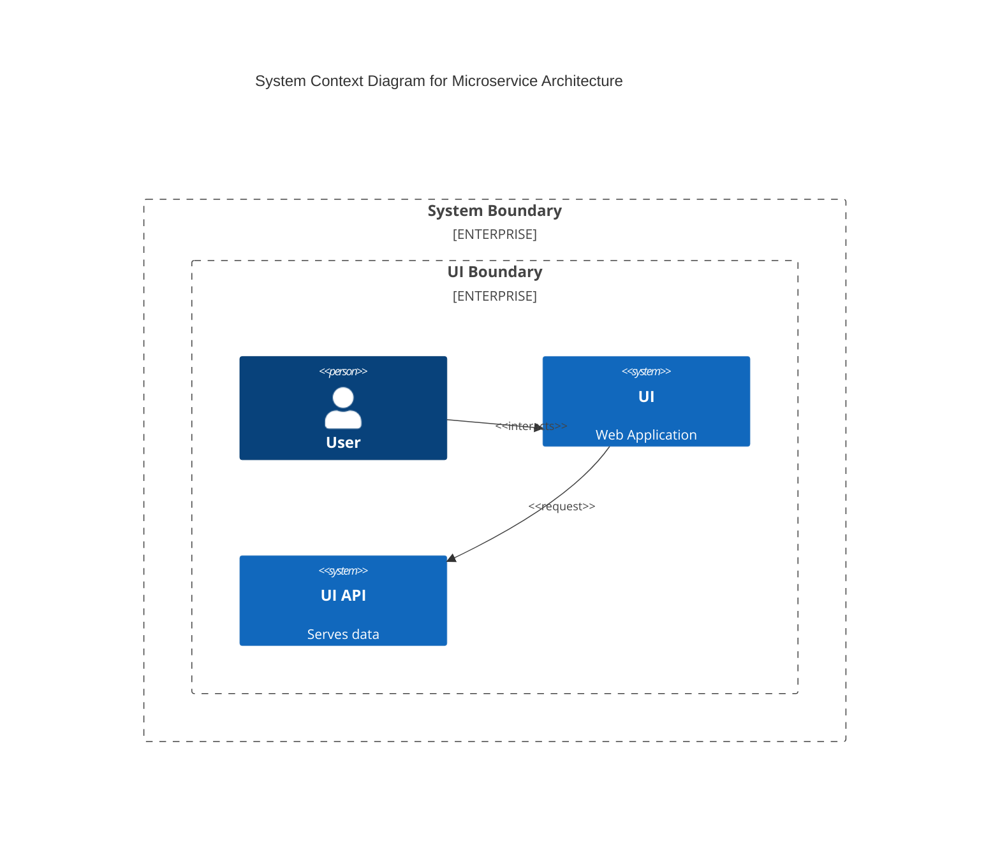

```mermaid
C4Context
  title System Context Diagram for Microservice Architecture

  Enterprise_Boundary(systemBoundary, "System Boundary") {
    Enterprise_Boundary(uiBoundary, "UI Boundary") {
      Person(user, "User", "")
      System(ui, "UI", "Web Application")
      System(uiApi, "UI API", "Serves data")
    }
  }

  Rel(user, ui, "<<interacts>>")
  Rel(ui, uiApi, "<<request>>")
```