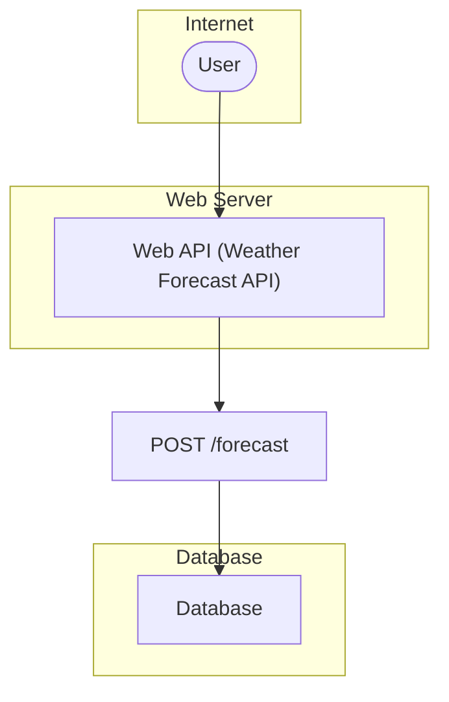

# C4 Component diagram for a simple Weather API with a POST endpoint

```mermaid
graph TB

subgraph "Internet"
A([User])
end

subgraph "Web Server"
B["Web API (Weather Forecast API)"]
end

subgraph "Database"
C[Database]
end

A --> B
B --> U[POST /forecast]
U --> C
```
