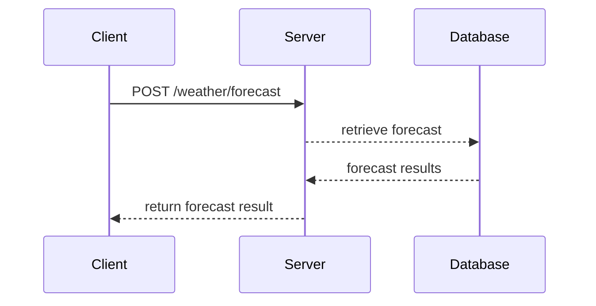
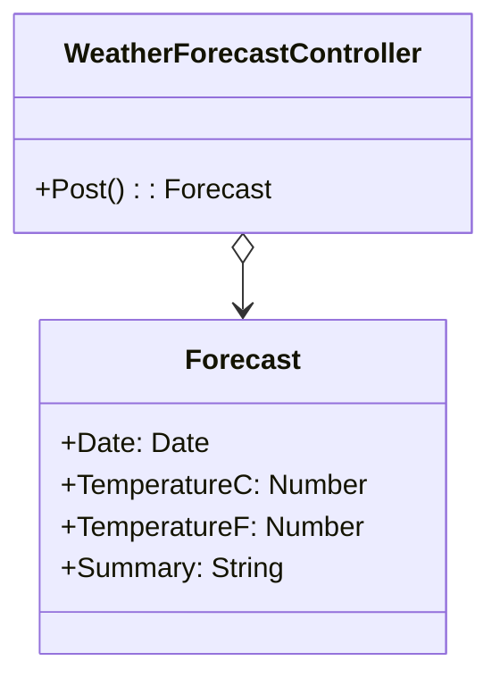

```mermaid
sequenceDiagram
  Participant Client as Client
  Participant Server as Server
  Client->>Server: POST /weather/forecast
  Server-->>Database: retrieve forecast
  Database-->>Server: forecast results
  Server-->>Client: return forecast result
```

```mermaid
classDiagram
  class WeatherForecastController {
    +Post(): Forecast
  }
  class Forecast {
    +Date: Date
    +TemperatureC: Number
    +TemperatureF: Number
    +Summary: String
  }
  WeatherForecastController o--> Forecast
```
