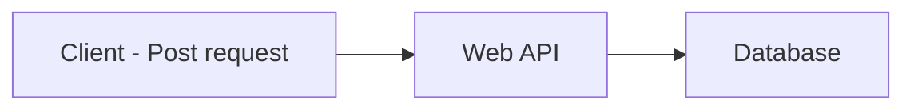
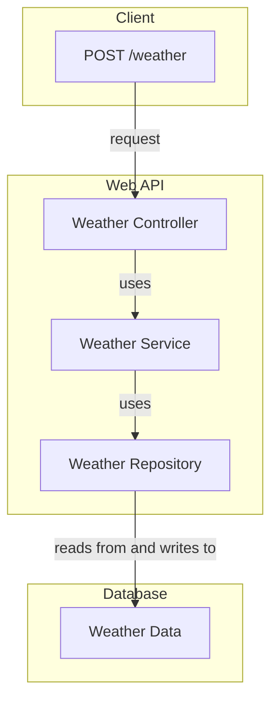

# Weather Forecast API

## High Level Overview

The Web API can be implemented using a technology such as ASP.NET Core or Node.js with Express.js. This service will expose a RESTful endpoint serving JSON.

This is a high-level overview of the system:

## C4 Component Diagram

Where each component represents:

- **Client**: Makes a POST request to the `/weather` endpoint with the information needed to retrieve the weather forecast.
- **Weather Controller**: This is the component in the Web API that handles HTTP requests and responses. It takes the POST request and passes the data to the Weather Service.
- **Weather Service**: This service is responsible for business logic and error handling. It takes the input data from the Controller, performs any necessary processing, and calls the Weather Repository.
- **Weather Repository**: This is the data access layer, responsible for interacting with the database. It takes the request from the Weather Service, performs database operations, and returns the result back to the Weather Service.
- **Database**: Contains the `Weather Data` where weather forecasts are stored.
