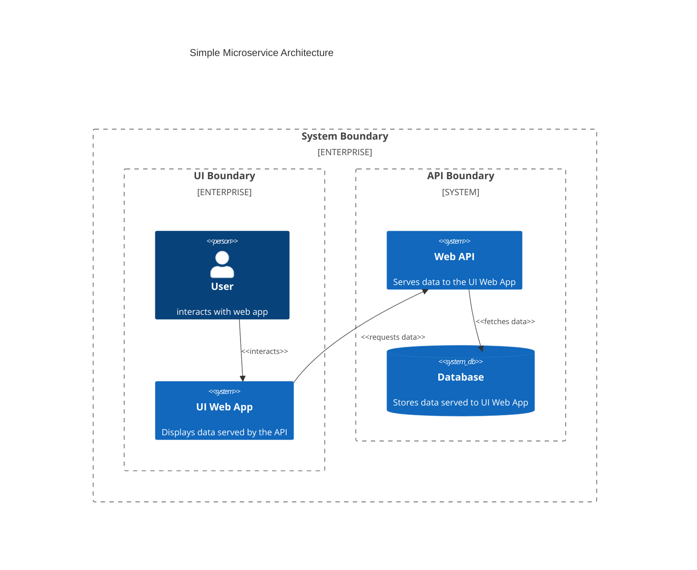

# Simple C4 Component Diagram for a Microservice Architecture

This diagram represents a simple microservice architecture consisting of a UI web application and a web API that serves data.

```mermaid
C4Context
  title Simple Microservice Architecture

  Enterprise_Boundary(systemBoundary, "System Boundary") {

    Enterprise_Boundary(uiBoundary, "UI Boundary") {
      Person(user, "User", "interacts with web app")
      System(ui, "UI Web App", "Displays data served by the API")
    }

    System_Boundary(apiBoundary, "API Boundary"){
      System(webApi, "Web API", "Serves data to the UI Web App")
      SystemDb(apiDb, "Database", "Stores data served to UI Web App")
    }
  }

  Rel(user, ui, "<<interacts>>")
  Rel(ui, webApi, "<<requests data>>")
  Rel(webApi, apiDb, "<<fetches data>>")

```
