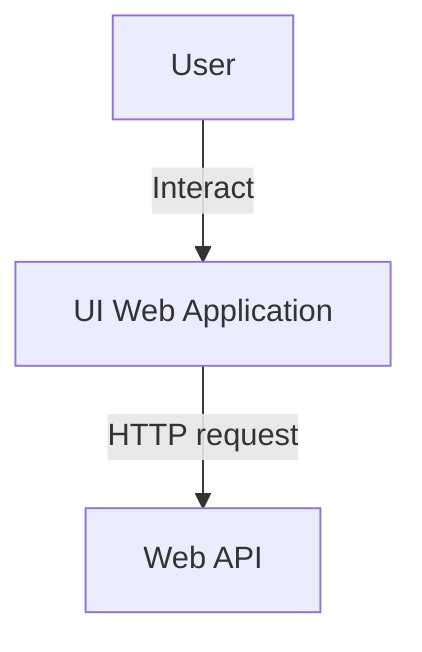
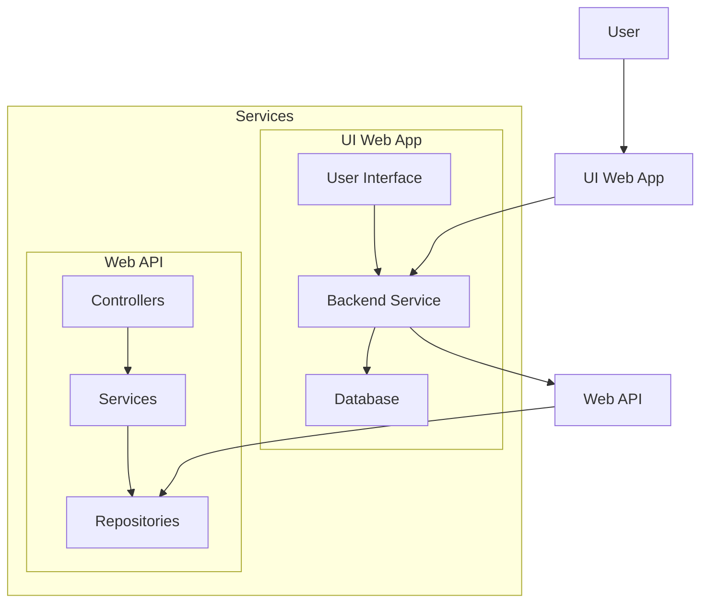

```mermaid
C4Component
  title Component Diagram for Microservice Architecture
  
  Container_Boundary(webBoundary, "Web Application") {
    Component(view, "View", "Framework UI")
    Component(controller, "Controller", "Process user input")
    Component_Router(router, "Router", "Routes requests")
  }
  
  Container_Boundary(apiBoundary, "Web API") {
    Component(apiController, "API Controller", "Serves and process data")
    Component(service, "Service", "Business logic")
    Component_Router(apiRouter, "API Router", "Routes API requests")
  }
  
  Rel(view, controller, "Interacts")
  Rel(controller, router, "Forwards requests")
  
  Rel(router, apiController, "Routes requests")
  Rel(apiController, apiRouter, "Forwards requests")
  Rel(apiRouter, service, "Routes requests")
```